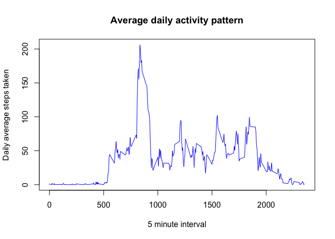
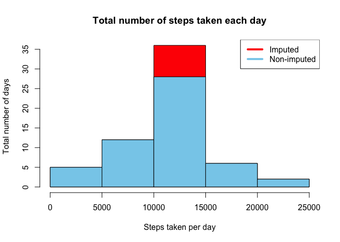
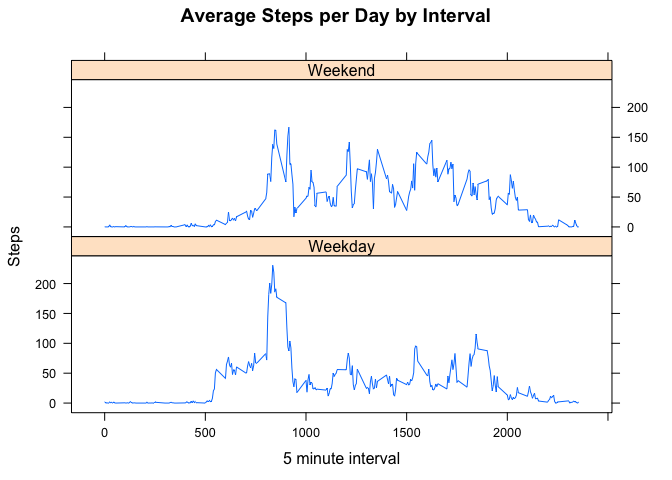

# Untitled
Chiang  

##About
This was the first project for the **Reproducible Research** course in Coursera's Data Science specialization track. 

## Data
The data for this assignment was downloaded from the course web site:

* Dataset: [Activity monitoring data](https://d396qusza40orc.cloudfront.net/repdata%2Fdata%2Factivity.zip) [52K]

The variables included in this dataset are:

* **steps**: Number of steps taking in a 5-minute interval (missing
    values are coded as `NA`)

* **date**: The date on which the measurement was taken in YYYY-MM-DD
    format

* **interval**: Identifier for the 5-minute interval in which
    measurement was taken

The dataset is stored in a comma-separated-value (CSV) file and there are a total of 17,568 observations in this dataset.

##Loading and preprocessing the data

```r
setwd("~/Desktop/R")
activity <- read.csv("activity.csv")
activity$date <- as.Date(as.character(activity$date))
```

##What is mean total number of steps taken per day?
* histogram shows the distribution of steps taken per day.
* In this case(ignoring missing values), the most frquent interval for steps taken per day ranges from 10,000 to 15,000 steps, which contains 25 days in total. 

```r
activityperday <- aggregate(steps~date,data = activity,sum)
hist(activityperday$steps,
     main = "Total number of steps taken each day",
     xlab = "Steps taken per day",
     ylab = "Total number of days",
     col = "pink"
     )
```

\

```r
rmean <- mean(activityperday$steps)
rmedian <- median(activityperday$steps)
```
The `mean` is 1.0766189\times 10^{4} and the `median` is 10765.

##What is the average daily activity pattern?
* Calculate average steps for each interval for all days. 
* Plot the Average Steps per Day by Interval. 
* Find interval with most average steps. 

```r
dailyavg <- aggregate(steps~interval, data = activity, mean)
plot(x = dailyavg$interval,
     y = dailyavg$steps,
     type = "l", 
     main = "Average daily activity pattern",
     xlab = "5 minute interval",
     ylab = "Daily average steps taken",
     col = "blue"
     )
```

\
extract the interval in which averagely the most steps are taken.

```r
dailyavg[which.max(dailyavg$steps),]
```

```
##     interval    steps
## 104      835 206.1698
```
count NA's (total of 2304)

```r
length(
  grep("TRUE",is.na(activity$steps))
  )
```

```
## [1] 2304
```
##Imputing missing values
* missing values are substituted with the mean of steps at the interval the missing value belongs to.

```r
activityadded <- activity

activityadded <- transform(
  activityadded, 
  steps = ifelse(is.na(activityadded$steps), 
                 dailyavg$steps[match(activityadded$interval, dailyavg$interval)], 
                 activityadded$steps)
  )
activityperdayadded <- aggregate(steps~date,data = activityadded,sum)
```
Create Histogram.

```r
hist(
  activityperdayadded$steps,
  main = "Total number of steps taken each day",
  xlab = "Steps taken per day",
  ylab = "Total number of days",
  col = "red"
     )
hist(activityperday$steps,
     main = "Total number of steps taken each day",
     xlab = "Steps taken per day",
     ylab = "Total number of days",
     col = "skyblue",
     add = T
)
legend("topright", c("Imputed", "Non-imputed"), col=c("red", "skyblue"), lwd=4)
```

\
Calculate new mean and median for imputed data.

```r
rmeanadded <- mean(activityperdayadded$steps)
rmedianadded <- median(activityperdayadded$steps)
```
Calculate difference between imputed and non-imputed data.

```r
meandiff <- rmeanadded - rmean
meddiff <- rmedianadded - rmedian
```
Calculate total difference.

```r
totaldiff <- sum(activityperdayadded$steps) - sum(activityperdayadded$steps)
```

* The imputed data mean is `rmeanadded`
* The imputed data median is `rmedianadded`
* The difference between the non-imputed mean and imputed mean is `meandiff`
* The difference between the non-imputed mean and imputed mean is `meddiff`
* The difference between total number of steps between imputed and non-imputed data is `totaldiff`. Thus, there were `totaldiff` more steps in the imputed data.


##Are there differences in activity patterns between weekdays and weekends?
Created a plot to compare difference between the week and weekend. 

```r
weekdays <- c("Monday", "Tuesday", "Wednesday", "Thursday", 
              "Friday")
activityadded$weekday = as.factor(
  ifelse(
    is.element(
      weekdays(as.Date(activityadded$date)),
      weekdays),
    "Weekday", 
    "Weekend"
    )
  )
dailyavgadded <- aggregate(steps~interval+weekday,data = activityadded,mean)

library(lattice)
xyplot(
  dailyavgadded$steps ~ 
    dailyavgadded$interval|dailyavgadded$weekday, 
  main="Average Steps per Day by Interval",
  xlab="5 minute interval", 
  ylab="Steps",
  layout=c(1,2), 
  type="l"
  )
```

\


